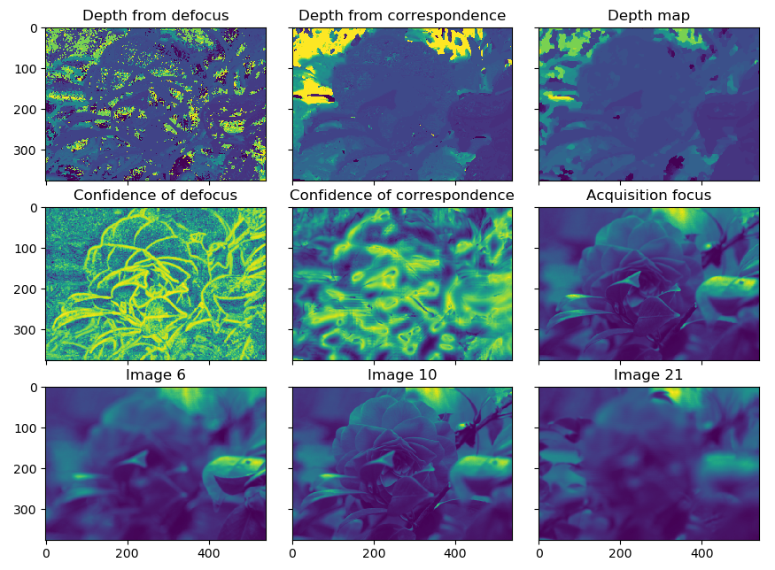
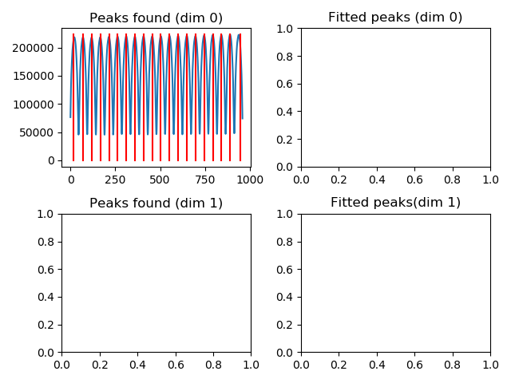
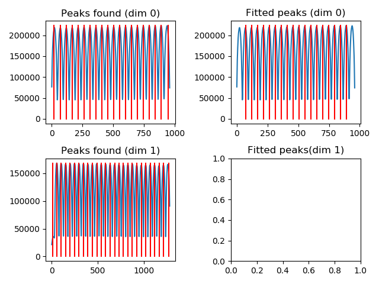
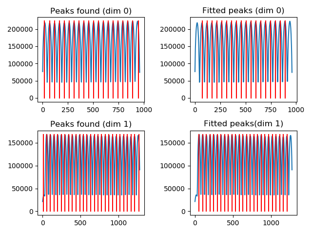

# Examples description

Here we analyse the code and results of the example files
Examples 02 and 03 use data from the [Stanford light-field archive](http://lightfields.stanford.edu/).

## example_01_logos.py

This is a preliminary example that serves to demonstrate the concepts discussed in:
> N. Viganò, et al., “Tomographic approach for the quantitative scene reconstruction from light field images,” Opt. Express, vol. 26, no. 18, p. 22574, Sep. 2018.

In particular it displays the position and size scaling of the refocused objects in the scene for different refocusing alpha parameter.

## example_02_flower_refocusing.py

This example demonstrates a selection of the possible refocusing options and tools available in plenoptomos.
It uses the [flowers & plants](http://lightfields.stanford.edu/flowers_plants.html)
example number 30 from the public Stanford light-field archive.
It is distributed in the ESLF format, and so it requires importing.

First we import the ESLF image of choice:
```
(lf_r ,lf_g, lf_b) = pleno.import_lf.from_lytro(dpath, jpath, source='eslf', mode='rgb')
```
By choosing the `mode='rgb'` we obtain three light-fields (one per RGB channel).

We then create a (v, u) PSF for each color channel, using the following two lines:
```
psf_ml_r = pleno.psf.PSF.create_theo_psf(lf_r.camera, coordinates='vu', airy_rings=2)
psf_ml_r = pleno.psf.PSFApply2D(psf_d=psf_ml_r)
```
which first create the theoretical PSF for an incoherent light source (for the wavelengths indicated in `lf_r.camera`), including only the first two orders of the Airy function.
The second line creates an object able to manipulate the light-field data, and apply the computed PSF.

The following line computes the acquisition focal plane in the object space:
```
z0 = lf_r.camera.get_focused_distance()
```
We then define the alpha parameters:
```
alphas_con = np.linspace(0.5, 3.0, 46)
```

We then convert the true distances in parallel beam distances because we will produce that type of refocused images:
```
alphas_par = lf_r.camera.get_alphas(alphas_con, beam_geometry_in='cone', beam_geometry_out='parallel')
z0s = z0 * alphas_par
```

For convenience we create a function that handles the RGB channels:
```
def refocus_rgb(refocus_func, renorm=False):
    imgs_r = refocus_func(lf_r, psf_ml_r)
    imgs_g = refocus_func(lf_g, psf_ml_g)
    imgs_b = refocus_func(lf_b, psf_ml_b)
    if renorm:
        lf_ones = lf_r.clone()
        lf_ones.data = np.ones_like(lf_ones.data)
        imgs_ones = refocus_func(lf_ones, psf_ml_r)
        imgs_r /= imgs_ones
        imgs_g /= imgs_ones
        imgs_b /= imgs_ones
    return pleno.colors.merge_rgb_images(imgs_r, imgs_g, imgs_b)
```
and lambda functions that handle the refocusing for each method.
The Integration, Back-projection and SIRT functions are straight-forward:
```
refocus_int = lambda x, _ : pleno.refocus.compute_refocus_integration(x, z0s_sel, beam_geometry='parallel')
refocus_bpj = lambda x, _ : pleno.tomo.compute_refocus_iterative(x, z0s_sel, beam_geometry='parallel', algorithm='bpj')
refocus_sirt = lambda x, _ : pleno.tomo.compute_refocus_iterative(x, z0s_sel, beam_geometry='parallel', iterations=3, algorithm='sirt')
```
while the CP-LS-TV version needs a Solver object defined with custom parameters chosen by the user:
```
algo = pleno.solvers.CP_tv(data_term='l2', lambda_tv=1e-1, axes=(-2, -1))
refocus_cplstv_p = lambda x, p : pleno.tomo.compute_refocus_iterative(x, z0s_sel, beam_geometry='parallel', iterations=50, algorithm=algo, psf=p)
```
This syntax allows the users to create their own refocusing algorithms, and pass them to the function `pleno.tomo.compute_refocus_iterative`.

The expected refocusing for one distance will be:


Which zoomed on the rose will be:


## example_03_flower_depth.py

This example displays the use of the depth-estimation routines available in plenoptomos.

In this case the light-field is loaded in grayscale mode:
```
lf = pleno.import_lf.from_lytro(dpath, jpath, source='eslf')
```

The depth cues described in Tao's paper are computed with the following function call:
```
dc = pleno.depth.compute_depth_cues(lf, z0s)
```

The computed depth cues are then assembled in a depth-map with the following optimization routine:
```
dm = pleno.depth.compute_depth_map(dc, lambda_tv=1.0, lambda_smooth=None)
```
The expected output is:


The function `compute_depth_cues` is highly tunable and allows the user to use advanced refocusing methods in the computation of the said depth cues.
For instance:
```
dc = pleno.depth.compute_depth_cues(lf, z0s, algorithm='sirt')
```
will use the sirt algorithm to compute the the focal stack.
Moreover, it allows more advanced filtering options than what was initially proposed in Tao's article.
Aside from the proposed rectangular filter (`window_shape='rect'`), it also accepts triangular (`'tri'`), circular (`'circ'`), gaussian (`'gauss'`) filters.
The size of the filters is adjusted using the option `window_size` (default: `window_size=(9, 9)`).


## example_04_letters.py

This fourth example shows the creation and calibration of .vox datasets from raw images, and a metadata file.

The used dataset was collected in the labs of [Imagine Optic](https://www.imagine-optic.com/) (Bordeaux, France).
The data collection has been performed by Charlotte Herzog, Pablo Martinez Gil, and Nicola Viganò.

To initiate this process, a few specific files are needed:
- A file containing the collected light-field data
```
raw_file = os.path.join(data_dir, 'letters_ULF_M1.png')
```
- A file containing the flat-field: it is also used for calibrating the light-field data
```
raw_file_white = os.path.join(data_dir, 'letters_ULF_M1_white.png')
```

- A file containing the dark-field (optional): it provides the background, but currently not used
```
raw_file_dark = os.path.join(data_dir, 'letters_ULF_M1_dark.png')
```

- A file containing the metadata in ini format. The names and sections follow the description of the vox data format
```
ini_file = os.path.join(data_dir, 'letters_ULF_M1.ini')
```

Finally we indicate the temporary uncalibrate and the final calibrated file names:
```
vox_file_uncal = os.path.join(data_dir, 'letters_ULF_M1_uncalibrated.vox')
vox_file = os.path.join(data_dir, 'letters_ULF_M1.vox')
```

We then proceed with the creation of the uncalibrated file with the following command:
```
pleno.data_format.create_vox_from_raw(raw_file, ini_file, raw_det_white=raw_file_white, raw_det_dark=raw_file_dark, out_file=vox_file_uncal)
```
and then to the interactive calibration:
```
pleno.data_format.calibrate_raw_image(vox_file_uncal, vox_file_out=vox_file)
```
This will open a window, which shows the peaks associated to the lenslets in each dimension of the raw detector image (it is obtained through a sum in the perpendicular direction).


In this case, the first and last peaks are either truncated or not fully illuminated, so it makes sense to remove them from the dataset.
For the fitting, moreover, we suggest to skip the first and last of the remaining set.

Once confirmed, the window will be updated to handle the other image dimension:


Also in this case, the first and last peaks can be removed from the dataset, and the first and last of the remaining set can be temporarily excluded from the fitting.

The fully fitted lenslet positions should look like the following:


The computed dimensions of the lenslets should be (48.2, 48.2273), and the expected offsets should be (46.5125, 30.5504).
In case a series of datasets were to be acquired with an identical camera setup, it is possible to skip the fitting procedure by passing directly the `pitch` (lenslet size) and `offset` values.

The calibrated dataset can then be loaded using the `load` function:
```
lfv = pleno.data_format.load(vox_file)
```

The rest of the example is mainly a duplicate of example 02.
